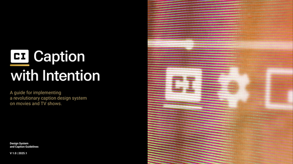
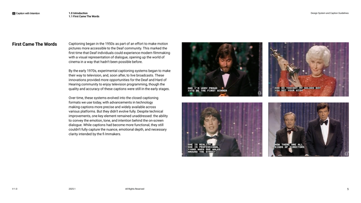

# Caption With Intention v2

> **Caption With Intention (CWI)** is a revolutionary caption design system for movies and TV shows that transforms closed captions from plain text into a rich, expressive experience — conveying **who** is speaking, **when** they speak, and **how** they sound.
>
> Built for the Deaf and hard-of-hearing community. Open source. Open future.

---

## Design System Preview

<p align="center">
  
</p>

The CWI system specifies 6 main, 12 supporting, and 24 minor character colors — all carefully chosen for visual distinction:

<p align="center">
  
</p>

---

## Table of Contents

- [About](#about)
- [The Three Shortcomings](#the-three-shortcomings)
- [Design System](#design-system)
- [MVP Automation](#mvp-automation)
- [Architecture](#architecture)
- [Project Structure](#project-structure)
- [Quick Start](#quick-start)
- [Development](#development)
- [Speaker Design](#speaker-design)
- [License](#license)

---

## About

Around the world, **466 million people** live with hearing disabilities. Since the inception of closed captioning in the 1970s, captions have not meaningfully evolved. What was once an innovative solution is now outdated, and its shortcomings negatively impact the viewing experience.

**Caption With Intention** addresses three core shortcomings:

| Shortcoming | Problem | Solution |
|-------------|---------|----------|
| **Attribution** | Captions don't identify who speaks | Color-coded captions per character |
| **Synchronization** | Captions lag behind dialogue | Word-by-word color sync at word onset |
| **Intonation** | No cues for emotion, volume, pitch | Variable typeface (Roboto Flex) mapping voice → typography |

Developed in partnership with the **Chicago Hearing Society** with community validation from February 2024 to December 2024.

---

## Design System

### Attribution Colors

| Character Tier | Colors | Count |
|---------------|--------|-------|
| **Main Characters** | Yellow `#E5E517`, Cyan `#17E5E5`, Red `#E51717`, Orange `#E58017`, Green `#17E517`, Pink `#E517E5` | 6 |
| **Supporting Characters** | 12 spectrum-derived shades | 12 |
| **Minor Characters** | Pastel tones (S=30%, B=90%) | 24 |

- **Main**: distinct colors spaced far apart on spectrum
- **Hero/Villain**: opposite positions in main palette
- **Supporting**: visually distant from main character colors
- **Off-camera**: same color as speaker + *italic* type

### Synchronization

| Feature | Description |
|---------|-------------|
| **Read-Ahead** | Full white text at 90% opacity shows complete sentence first |
| **Color Sync** | Words change to character color at word onset (not completion) |
| **Pop Motion** | 15% type size pop at each spoken word |
| **Syllable Variation** | Syllable-level animation when alignment confidence is sufficient |

### Intonation Mapping

| Voice Property | Typeface Mapping |
|---------------|-----------------|
| **Volume** | Type size: 3% (whisper) → 5% (normal) → 12% (yell) |
| **Pitch** | Weight: 80-160 Hz → heavy; 160-200 Hz → neutral 400; 200+ Hz → light |
| **Harmonics** | Width: low harmonics → wide; high harmonics → narrow |
| **Baseline** | 160-200 Hz → Roboto Regular 400 |

### Caption Box & Work Area

| Parameter | Value |
|-----------|-------|
| Caption box | 90% black opacity |
| Work area | Lower 20% of frame |
| Max lines per frame | 2 |
| Type size range | 3% – 12% of screen height |
| Baseline type size | 5% of screen height |
| Typeface | Roboto Flex (variable font) |

---

## MVP Automation

This project is the **open-source automation engine** for the Caption With Intention design system. It turns published design rules into a deterministic, local-first, AI-assisted caption production system.

### Architecture

```
┌──────────────────────────────────────────┐
│  Desktop UI (React + TypeScript)         │
└──────────────┬───────────────────────────┘
               │ IPC / WebChannel
┌──────────────▼───────────────────────────┐
│  Python Orchestration Layer               │
├──────────────────────────────────────────┤
│  engine/core/     │ Engine Infrastructure │
│  engine/media/    │ Probe & Ingest        │
│  engine/scenes/   │ Shot Detection &      │
│                   │ Chunking              │
│  engine/ingest/   │ Media Ingest          │
│  engine/project/  │ Project Engine        │
│  engine/rules/    │ CI Rules              │
│  engine/typing/   │ Audio → Typography    │
├──────────────────────────────────────────┤
│  Canonical CI Project JSON + Cache        │
└──────────────┬───────────────────────────┘
               │
    ┌──────────┴──────────┐
    │                     │
┌───▼──────┐     ┌───────▼──────┐
│ SRT/VTT/ │     │ Burn-in      │
│ TTML/ASS │     │ Render (FFmpeg)│
└──────────┘     └──────────────┘
```

### Pipeline Stages

```
┌─────────────────────────────────────────────┐
│          SceneListPipeline                  │
├─────────────┬──────────────┬────────────────┤
│             │              │                │
│  ┌─────────▼──────────┐  │  ┌────────────┐ │
│  │ ShotDetectionStage │  │  │ Chunking   │ │
│  │                    │  │  │ Stage      │ │
│  │ FFmpeg scene       │  │  │            │ │
│  │ detection          │  │  │ Adaptive   │ │
│  │                    │  │  │ chunk gen  │ │
│  └────────┬───────────┘  │  └────────────┘ │
│           │              │                │
│  ┌────────▼───────────┐ │                │
│  │SceneGroupingStage  │ │                │
│  │                    │ │                │
│  │ Groups shots into  │ │                │
│  │ scenes             │ │                │
│  └────────┬───────────┘ │                │
│           │              │                │
└───────────┴──────────────┴────────────────┘
```

### Key Principles

1. **Deterministic rules** — colors, timing, typography enforced by renderer, not invented by AI
2. **AI is assistive** — proposes metadata; every decision is editable
3. **Local-first** — runs offline after models are installed
4. **Two distribution paths** — compatibility sidecar (SRT/VTT/TTML/ASS) and burned-in visual CI video

### Milestones

| Milestone | Description | Status |
|-----------|-------------|--------|
| M0 | Project foundation (structure, profiles, core engine) | ✅ Complete |
| M1 | Media ingest and metadata | ✅ Complete |
| M2 | Scene/chunk engine + modular architecture + optimization | ✅ Complete |
| M3 | Caption import/export (SRT/VTT/TTML/ASS) | 🔲 Pending |
| M4 | Deterministic CI renderer | 🔲 Pending |
| M5–M20 | AI pipeline, editor UI, export, packaging | 🔲 Pending |

---

## Architecture

### Core Infrastructure (`engine/core/`)

| Module | Purpose |
|--------|---------|
| `registry.py` | Plugin registry with `__init_subclass__` auto-registration (thread-safe) |
| `pipeline.py` | `PipelineStage` ABC + `Pipeline` runner (sequential & parallel) |
| `ffmpeg.py` | Centralized FFmpeg/ffprobe utility with error handling + metadata cache |
| `cache.py` | `MemoryCache` (TTL) + `cached()` LRU decorator |

### Pipeline Stages (`engine/scenes/`)

```
SceneListPipeline
├── ShotDetectionStage    → FFmpeg scene detection
├── SceneGroupingStage    → Shot boundary → Scene grouping
└── ChunkingStage         → Adaptive chunk generation
```

### Performance Optimizations

| Optimization | Impact |
|-------------|--------|
| `@dataclass(slots=True)` on dataclasses | ~80% per-instance memory reduction |
| Pydantic `model_config["slots"]=True` | Reduced model memory |
| `probe_video()` mtime-based cache | Eliminates redundant ffprobe calls |
| ThreadPoolExecutor in `ingest_media()` | Parallel probe + hash (I/O concurrent) |
| `generate_chunks_lazy()` generator | Memory-efficient chunk iteration |

---

## Project Structure

```
Caption_With_Intention_v2/
├── README.md                     # This file
├── CAPTION_WITH_INTENTION.md     # Full design system documentation
├── docs/
│   ├── assets/                   # Images extracted from design system PDF
│   │   ├── cover-01.png          # Cover page
│   │   └── colors-05.png         # Color palette page
│   └── M0_CHECKPOINT.md          # Milestone documentation
├── Caption-With-Intention_Design-System_V1.0.pdf  # Official design system PDF
├── CaptionWithIntention_Automation_MVP_Spec.md     # MVP engineering spec
├── pyproject.toml                # Python project configuration
├── design_systems/
│   └── caption_with_intention/
│       └── v1.0/                 # Design system profiles (JSON)
│           ├── profile.json
│           ├── colors.json
│           ├── typography.json
│           ├── synchronization.json
│           ├── elements.json
│           ├── exports.json
│           ├── exceptions.json
│           ├── music.json
│           └── sound_effects.json
├── engine/                       # Python engine modules
│   ├── core/                     # Infrastructure (new in M2)
│   │   ├── registry.py           # Plugin registry
│   │   ├── pipeline.py           # Pipeline runner
│   │   ├── ffmpeg.py             # FFmpeg utility + cache
│   │   └── cache.py              # MemoryCache + LRU decorator
│   ├── media/                    # FFmpeg probing & ingest
│   │   └── probe.py              # probe_video(), compute_source_hash()
│   ├── ingest/                   # Media ingest orchestration
│   │   ├── ingest.py             # ingest_media(), quick_probe()
│   │   └── proxy.py              # Proxy video generation
│   ├── scenes/                   # Shot detection & chunking
│   │   ├── models.py             # Scene, Shot, SceneType
│   │   ├── shot_detection.py     # FFmpeg scene detection
│   │   ├── chunking.py           # Adaptive chunking + lazy generator
│   │   ├── scene_list.py         # SceneListPipeline + public API
│   │   └── checkpoint.py         # Persistent checkpoint system
│   ├── project/                  # Project engine (create/open/save)
│   ├── rules/                    # Color, palette, profile loaders
│   ├── typography/               # Audio → typography mapping
│   ├── audio_analysis/           # Loudness, pitch, harmonics
│   ├── logging/                  # Structured JSON logging
│   ├── errors/                   # Error classification (13 categories)
│   ├── active_speaker/           # Active speaker (M3+): diarization PRIMARY
│   ├── diarization/              # Speaker diarization (M3+): PRIMARY method
│   ├── face_tracking/            # Face tracking (M3+): FALLBACK only
│   ├── asr/                      # Speech recognition (M3+)
│   ├── renderer/                 # CI visual rendering (M4+)
│   ├── exporters/                # SRT/VTT/TTML/ASS export (M3+)
│   ├── alignment/                # Caption-to-audio alignment (M3+)
│   ├── animation/                # Caption animation (M3+)
│   ├── music/                    # Music analysis (M3+)
│   └── sound_events/             # Sound event detection (M3+)
├── schemas/                      # Canonical data model (Pydantic v2)
├── frontend/                     # React + TypeScript UI
│   ├── editor/
│   ├── timeline/
│   ├── preview/
│   ├── inspector/
│   └── speaker-panel/
├── apps/                         # Desktop & CLI apps
├── tests/                        # Unit, integration, fixture tests (111 passing)
├── docs/                         # Documentation & checkpoints
├── scripts/                      # Automation & verification scripts
├── design_systems/               # Design system JSON profiles
├── captions/                     # Caption outputs
├── config/                       # Project configuration
├── output/                       # Final deliverables
├── templates/                    # Color/style templates
├── .gitignore
└── .venv/                        # Python virtual environment
```

---

## Design System Pages

<p align="center">
  
  
</p>

---

## Quick Start

### Prerequisites

- Python ≥ 3.11
- FFmpeg (with libx264, libx265, libass)
- Node.js ≥ 18 (for frontend development)

### Setup

```bash
# Create virtual environment
uv venv .venv

# Install dependencies
uv pip install -e .

# Or install manually
.venv/bin/pip install pydantic numpy scipy pytest

# Verify installation
.venv/bin/python scripts/verify_m0.py
```

### Running Tests

```bash
.venv/bin/python -m pytest tests/unit/ -v
.venv/bin/python -m pytest tests/integration/ -v

# Run verification scripts
.venv/bin/python scripts/verify_m0.py
.venv/bin/python scripts/verify_m1.py
.venv/bin/python scripts/verify_m2.py
```

---

## Development

### Code Style

- Type hints required on all public functions
- Structured JSON logging via `engine/logging/logger.py`
- Error handling via `engine/errors/errors.py`
- Design constants only in `design_systems/caption_with_intention/v1.0/*.json`
- Plugin/registry pattern for extensibility via `engine/core/registry.py`
- Pipeline stages via `engine/core/pipeline.py`

### Commit Convention

- `[M0]` Project foundation milestones
- `[M1]` Media ingest milestones
- `[M2]` Scene/chunk engine + optimization milestones
- etc.

Each milestone is a checkpoint commit for easy rollback and tracking.

---

## Speaker Design Decision

> **Speaker diarization is PRIMARY.** Speech ultimately comes from humans, so speaker identification should be driven by audio diarization. Face/video tracking is a **fallback only** when diarization confidence is low.

| Priority | Method | Use Case |
|----------|--------|----------|
| **Primary** | Speaker diarization | Standard speaker identification from audio |
| **Fallback** | Face/video tracking | When diarization confidence is low |
| **Any avatar** | Custom models | Cartoon faces, dinosaurs, custom avatars — not limited to real faces |

This architecture ensures: **diarization → confidence check → face tracking only as fallback**.

---

## License

This project implements the Caption With Intention design system as described in the official design system documentation.

- **Design system material**: Caption With Intention Design System & Caption Guidelines V1.0 (2025.1) — All Rights Reserved
- **Implementation code**: Open source (license TBD — MIT or Apache-2.0 under consideration)
- **Third-party dependencies**: Each verified individually for license compatibility

The design system is implemented as an open-source automation tool. Community contributions are welcome.
